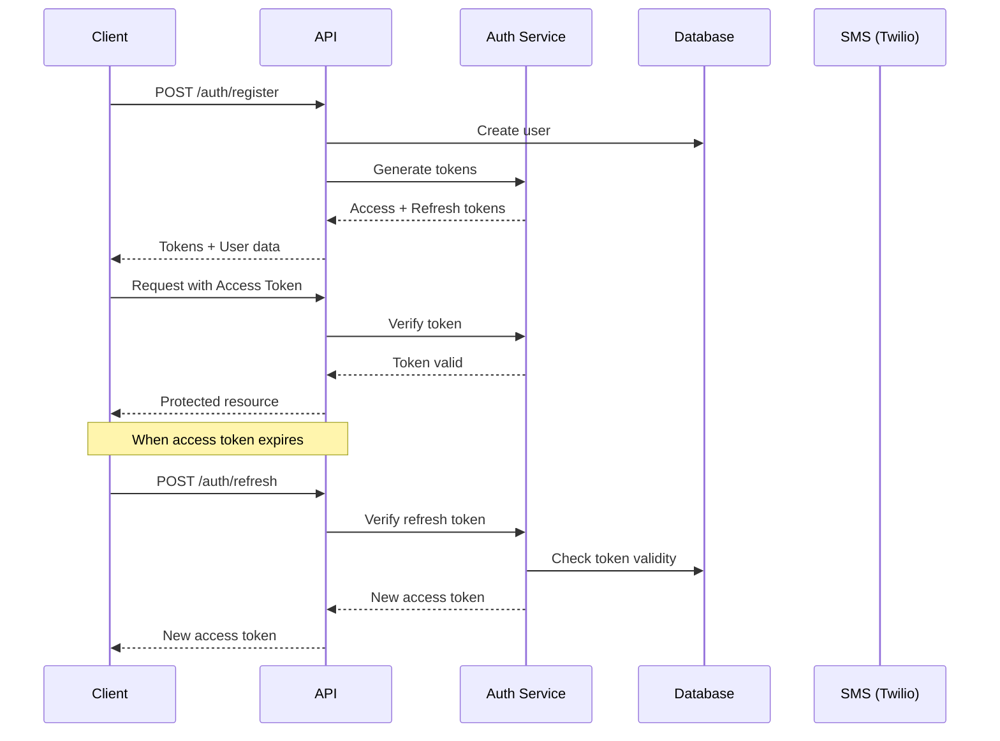

# Authentication & Authorization Guide

## Overview

Life OS uses JWT-based authentication with refresh tokens for secure, scalable user authentication. The system supports SMS-based 2FA and is designed for future SSO integration.

## Authentication Flow



## JWT Token Structure

### Access Token (15 minutes)
```typescript
interface AccessTokenPayload {
  sub: string;          // User ID
  email: string;        // User email
  role: UserRole;       // User role
  orgId?: string;       // Organization ID (if applicable)
  permissions: string[]; // Granular permissions
  iat: number;          // Issued at
  exp: number;          // Expiration (15 min)
  jti: string;          // Unique token ID
}
```

### Refresh Token (7 days)
```typescript
interface RefreshTokenPayload {
  sub: string;          // User ID
  tokenFamily: string;  // Token family ID for rotation
  iat: number;          // Issued at
  exp: number;          // Expiration (7 days)
  jti: string;          // Unique token ID
}
```

## Implementation

### Token Generation

```typescript
// services/auth-service.ts
import jwt from 'jsonwebtoken';
import { randomBytes } from 'crypto';

export class AuthService {
  private readonly accessTokenSecret = process.env.JWT_ACCESS_SECRET!;
  private readonly refreshTokenSecret = process.env.JWT_REFRESH_SECRET!;
  private readonly accessTokenExpiry = '15m';
  private readonly refreshTokenExpiry = '7d';
  
  async generateTokens(user: User): Promise<TokenPair> {
    const tokenId = randomBytes(16).toString('hex');
    const tokenFamily = randomBytes(16).toString('hex');
    
    // Get user permissions
    const permissions = await this.getUserPermissions(user.id);
    
    // Generate access token
    const accessToken = jwt.sign(
      {
        sub: user.id,
        email: user.email,
        role: user.role,
        orgId: user.organizationId,
        permissions,
        jti: tokenId,
      },
      this.accessTokenSecret,
      {
        expiresIn: this.accessTokenExpiry,
        issuer: 'lifeos.app',
        audience: 'lifeos.app',
      }
    );
    
    // Generate refresh token
    const refreshTokenId = randomBytes(16).toString('hex');
    const refreshToken = jwt.sign(
      {
        sub: user.id,
        tokenFamily,
        jti: refreshTokenId,
      },
      this.refreshTokenSecret,
      {
        expiresIn: this.refreshTokenExpiry,
        issuer: 'lifeos.app',
      }
    );
    
    // Store refresh token in database
    await this.storeRefreshToken({
      id: refreshTokenId,
      userId: user.id,
      tokenFamily,
      expiresAt: new Date(Date.now() + 7 * 24 * 60 * 60 * 1000),
    });
    
    return { accessToken, refreshToken };
  }
  
  async verifyAccessToken(token: string): Promise<AccessTokenPayload> {
    try {
      const payload = jwt.verify(token, this.accessTokenSecret, {
        issuer: 'lifeos.app',
        audience: 'lifeos.app',
      }) as AccessTokenPayload;
      
      // Check if token is blacklisted
      const isBlacklisted = await redis.exists(`blacklist:${payload.jti}`);
      if (isBlacklisted) {
        throw new AuthError('TOKEN_BLACKLISTED', 'Token has been revoked');
      }
      
      return payload;
    } catch (error) {
      if (error instanceof jwt.TokenExpiredError) {
        throw new AuthError('TOKEN_EXPIRED', 'Access token has expired');
      }
      if (error instanceof jwt.JsonWebTokenError) {
        throw new AuthError('INVALID_TOKEN', 'Invalid access token');
      }
      throw error;
    }
  }
  
  async refreshAccessToken(refreshToken: string): Promise<TokenPair> {
    try {
      const payload = jwt.verify(
        refreshToken,
        this.refreshTokenSecret
      ) as RefreshTokenPayload;
      
      // Check if refresh token exists and is valid
      const storedToken = await db.refreshToken.findUnique({
        where: { id: payload.jti },
        include: { user: true },
      });
      
      if (!storedToken || storedToken.revoked) {
        throw new AuthError('INVALID_REFRESH_TOKEN', 'Invalid refresh token');
      }
      
      // Implement refresh token rotation
      await this.revokeTokenFamily(storedToken.tokenFamily);
      
      // Generate new token pair
      return this.generateTokens(storedToken.user);
    } catch (error) {
      if (error instanceof jwt.TokenExpiredError) {
        throw new AuthError('REFRESH_TOKEN_EXPIRED', 'Refresh token has expired');
      }
      throw error;
    }
  }
  
  private async revokeTokenFamily(tokenFamily: string): Promise<void> {
    await db.refreshToken.updateMany({
      where: { tokenFamily },
      data: { revoked: true, revokedAt: new Date() },
    });
  }
}